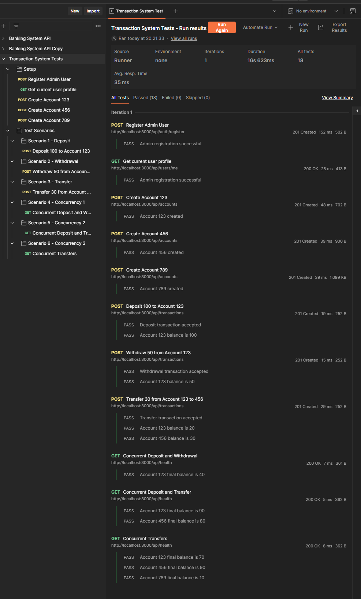

# Sistema Bancário - Testes Automatizados no Postman



## Pré-requisitos

- Docker e Docker Compose instalados
- Node.js instalado
- Postman instalado

## Configuração do Ambiente

1. **Iniciar os Serviços**

   ```bash
   # Inicia o banco de dados e serviços necessários
   docker compose up -d

   # Inicia a aplicação
   npm run start
   ```

2. **Importar a Coleção no Postman**
   - Abra o Postman
   - Clique no botão "Import" no canto superior esquerdo
   - Selecione o arquivo `transaction-system-tests.postman_collection.json`
   - Confirme a importação

## Executando os Testes

1. **Configurar a Execução**

   - No Postman, localize a coleção importada "transaction-system-tests"
   - Clique nos três pontos (...) ao lado do nome da coleção
   - Selecione "Run collection"
   - Configure o "Delay" para 500ms

2. **Iniciar os Testes**
   - Clique no botão azul "Run Banking System Tests"
   - Acompanhe o progresso na janela de execução

## Cenários de Teste

A coleção inclui os seguintes cenários:

### 1. Configuração Inicial

- Registro de usuário administrador
- Criação de três contas bancárias

### 2. Testes de Transações

1. **Cenário 1 - Depósito**

   - Depósito de 100 na Conta 1
   - Verificação do saldo final

2. **Cenário 2 - Saque**

   - Saque de 50 da Conta 1
   - Verificação do saldo final

3. **Cenário 3 - Transferência**
   - Transferência de 30 da Conta 1 para Conta 2
   - Verificação dos saldos em ambas as contas

### 3. Testes de Concorrência

1. **Cenário 4 - Depósito e Saque Concorrentes**

   - Depósito de 50 e saque de 30 simultâneos na Conta 1
   - Verificação do saldo final

2. **Cenário 5 - Depósito e Transferência Concorrentes**

   - Depósito de 100 e transferência de 50 simultâneos
   - Verificação dos saldos finais

3. **Cenário 6 - Transferências Concorrentes**
   - Duas transferências simultâneas entre três contas
   - Verificação dos saldos finais em todas as contas

## Observações

- Cada teste inclui verificações automáticas dos saldos
- O delay de 500ms entre as requisições garante a execução adequada dos testes
- Os testes verificam não apenas o sucesso das transações, mas também a consistência dos saldos

## Resultados Esperados

Após a execução, todos os testes devem passar, demonstrando:

- Funcionamento correto das operações básicas (depósito, saque, transferência)
- Tratamento adequado de concorrência
- Consistência dos saldos após operações simultâneas
- Integridade das transações em cenários complexos
